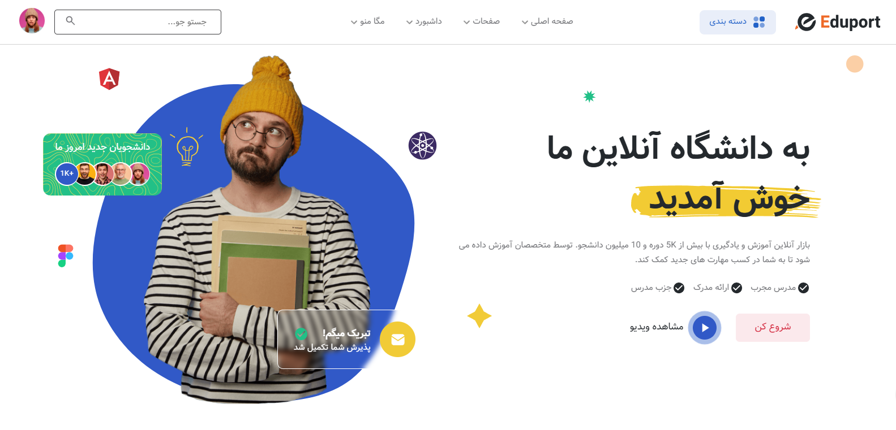

# وب‌سایت نمونه کار: نمایش مهارت‌های HTML, CSS, JavaScript

 <!-- عکس از وبسایت را در اینجا قرار دهید -->

این وب‌سایت به عنوان نمونه کار طراحی شده است تا مهارت‌های من در زمینه توسعه وب با استفاده از **HTML**, **CSS** و **JavaScript خام** (بدون استفاده از هیچ فریم‌ورک یا کتابخانه‌ای) را نمایش دهد. این پروژه کاملاً از صفر کدنویسی شده و هیچ وابستگی به ابزارهای خارجی ندارد.

## 🔗 لینک دمو
[مشاهده وب‌سایت به صورت زنده](https://amirrezazade.github.io/eduport/) <!-- لینک دموی سایت را اینجا قرار دهید -->

---

## ✨ ویژگی‌های پروژه

- **تم دارک/روشن و حالت اتوماتیک**: کاربران می‌توانند بین تم دارک و روشن سوئیچ کنند یا از حالت اتوماتیک استفاده کنند که بر اساس تنظیمات سیستم تغییر می‌کند.
- **اسلایدر تعاملی**: یک اسلایدر زیبا و روان که با JavaScript خام پیاده‌سازی شده است.
- **مگامنو پیشرفته**: منوی پیشرفته‌ای که در همه دستگاه‌ها به خوبی کار می‌کند و تجربه کاربری عالی ارائه می‌دهد.
- **رسپانسیو کامل**: سایت در همه دستگاه‌ها (موبایل، تبلت و دسکتاپ) به طور کامل سازگار و بهینه شده است.

---

## 🛠️ تکنولوژی‌های استفاده شده

- **HTML**: ساختار اصلی وب‌سایت.
- **CSS**: استایل‌دهی و طراحی ظاهری سایت، شامل انیمیشن‌ها و ترنزیشن‌ها.
- **JavaScript**: پیاده‌سازی تعاملات دینامیک مانند اسلایدر، مگامنو و سوئیچ تم.

---

## 🚀 نحوه راه‌اندازی پروژه

اگر می‌خواهید این پروژه را به صورت محلی اجرا کنید، مراحل زیر را دنبال کنید:

1. ریپازیتوری را کلون کنید:
   ```bash
   git clone https://github.com/amirRezazade/eduport.git